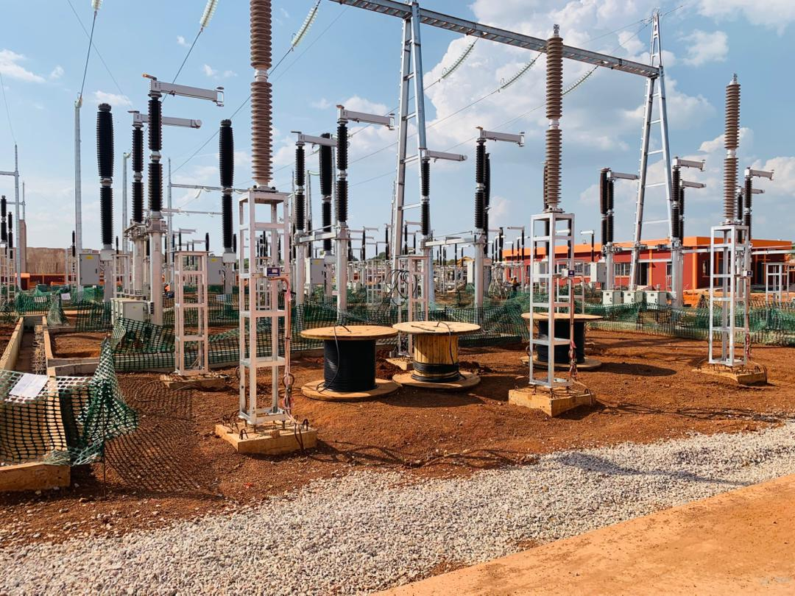
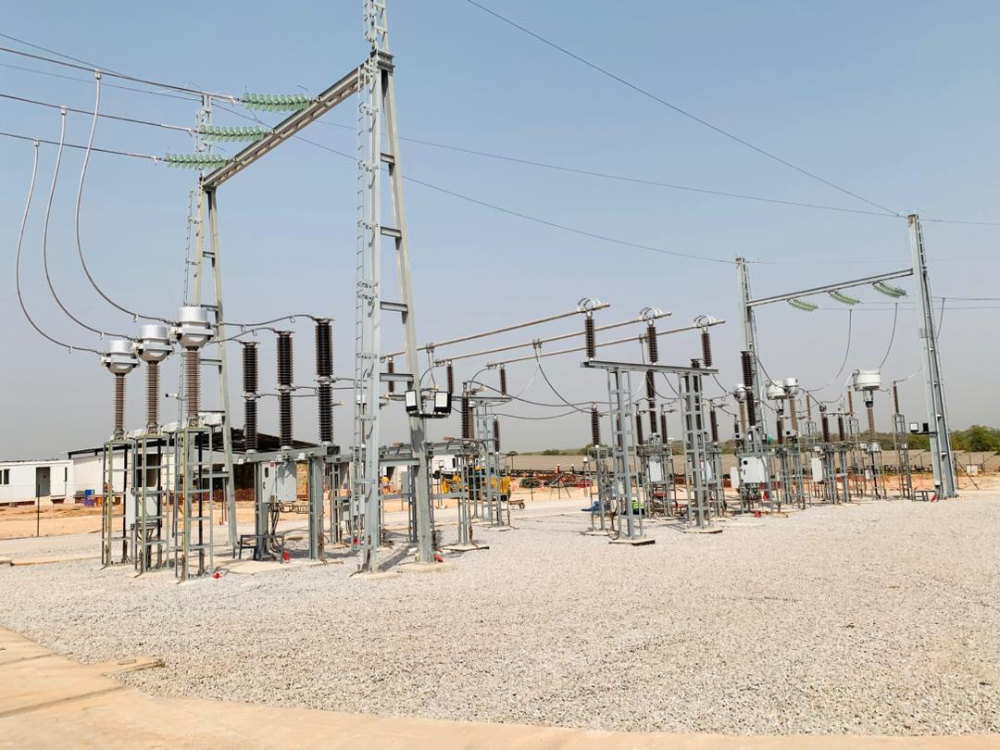
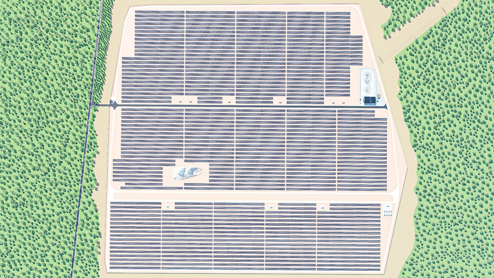
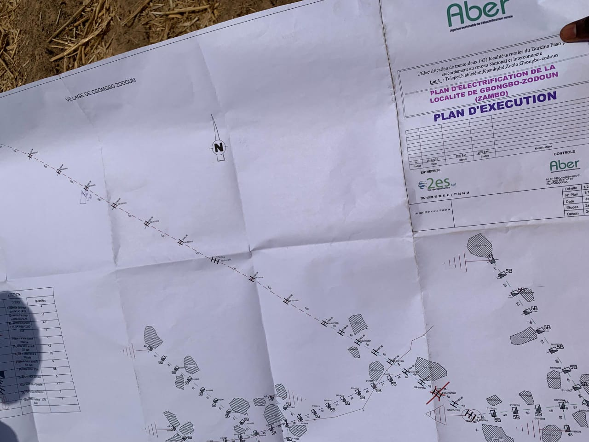
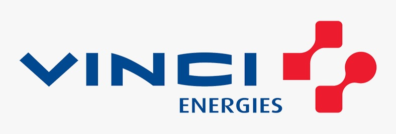
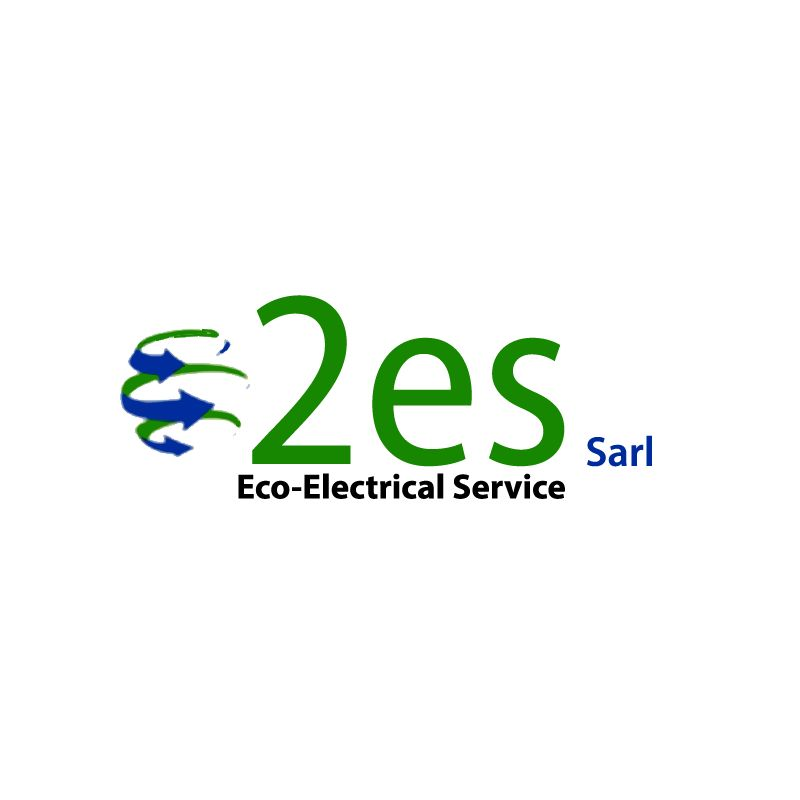
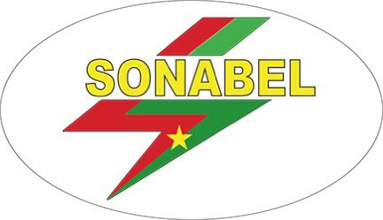

<!DOCTYPE html>
<html lang="en-US">
  <head>
    <meta charset="UTF-8">
    <meta http-equiv="X-UA-Compatible" content="IE=edge">
    <meta name="viewport" content="width=device-width, initial-scale=1">
    
<!-- Begin Jekyll SEO tag v2.8.0 -->
<title>portfolio-phanu</title>
<meta name="generator" content="Jekyll v3.10.0" />
<meta property="og:title" content="portfolio-phanu" />
<meta property="og:locale" content="en_US" />
<link rel="canonical" href="https://cdjarabe07.github.io/portfolio-phanu/" />
<meta property="og:url" content="https://cdjarabe07.github.io/portfolio-phanu/" />
<meta property="og:site_name" content="portfolio-phanu" />
<meta property="og:type" content="website" />
<meta name="twitter:card" content="summary" />
<meta property="twitter:title" content="portfolio-phanu" />

<!-- End Jekyll SEO tag -->
    <link rel="stylesheet" href="/portfolio-phanu/assets/css/style.css?v=59b408cf64f48c918726a98f7bfbbc985b9f4ba0">
    <!-- start custom head snippets, customize with your own _includes/head-custom.html file -->
<!-- Setup Google Analytics -->
<!-- You can set your favicon here -->
<!-- link rel="shortcut icon" type="image/x-icon" href="/portfolio-phanu/favicon.ico" -->
<!-- end custom head snippets -->

  </head>
  <body>
    

      <h1><a href="https://cdjarabe07.github.io/portfolio-phanu/">portfolio-phanu</a></h1>
      
&lt;!DOCTYPE html&gt;

<html lang="fr">
<head>
  <meta charset="UTF-8" />
  <meta name="viewport" content="width=device-width, initial-scale=1.0" />
  <title>Portfolio – Djarabé Djeramadji Phanuel</title>
  
</head>
<body>

<nav>
<strong style="color:var(--accent)">Phanuel</strong>
<ul>
<li><a href="#about">À propos</a></li>
<li><a href="#skills">Compétences</a></li>
<li><a href="#projects">Projets</a></li>
<li><a href="#experience">Expériences</a></li>
<li><a href="#education">Formation</a></li>
<li><a href="#contact">Contact</a></li>
<li><a href="#references">Références</a></li>
</ul>
<a href="CV_Phanuel.pdf" class="btn-cv" download="">Télécharger le CV</a>
</nav>

<header>
<h1>Djarabé Djeramadji Phanuel</h1>
<h3>Ingénieur Génie Électrique &amp; Énergétique</h3>

Passionné par la conception et l’optimisation de systèmes électriques et photovoltaïques pour soutenir la transition énergétique en Afrique.

</header>

<section id="about">
<h2>À propos</h2>

Ingénieur en Génie Électrique et Énergétique, je mets mes compétences au service de la transformation énergétique en Afrique. Spécialisé dans le dimensionnement des réseaux électriques et les systèmes solaires photovoltaïques, je conçois des solutions techniques fiables, optimisées et adaptées aux réalités locales.

Au-delà de la technique, ma vision est claire : accélérer l’accès à une énergie durable, soutenir l’industrialisation et contribuer activement à la modernisation des infrastructures électriques. Chaque projet est pour moi une opportunité d’allier performance technique, viabilité économique et impact social.

</section>

<section id="skills">
<h2>Compétences</h2>
  

  

<h3>Réseaux électriques</h3>
<ul>
<li>Dimensionnement de lignes et postes HTB, HTA et BT</li>
<li>Études de raccordement au réseau</li>
<li>Lecture et élaboration de schémas électriques</li>
<li>Suivi de travaux</li>
<li>Réalisation de plans de raccordement</li>
</ul>

<h3>Énergies renouvelables</h3>
<ul>
<li>Dimensionnement de centrales photovoltaïques</li>
<li>Études technico-économiques de projets solaires</li>
<li>Intégration de systèmes de stockage d’énergie (BESS)</li>
<li>Analyse de production et optimisation énergétique</li>
</ul>

<h3>Analyse &amp; Gestion de projet</h3>
<ul>
<li>Étude de faisabilité</li>
<li>Estimation quantitative et financière</li>
<li>Planification technique</li>
<li>Coordination terrain</li>
</ul>

<h3>Outils</h3>
<ul>
<li>PVCase, PVSyst, Diablux, XLPro, NEPLAN, AutoCAD, ARCGis, QGis</li>
<li>MS Project, Word, PowerPoint, Excel avancé, Access</li>
</ul>
<h3>Compétences supplémentaires</h3>
<ul>
<li>Énergie éolienne (principes de fonctionnement et intégration réseau)</li>
<li>Hydroélectricité (bases de conception et production)</li>
<li>Systèmes CVC pour bâtiments (VRV/VRF, principes de dimensionnement)</li>
</ul>

</section>

<section id="projects">
  <h2>Projets</h2>

  

    <!-- 1. KONE -->
    

      
      

<strong>Février 2026 - A nos jours</strong>

        <h4>Superviseur de travaux - Projet de construction du poste 225 kV de la mine d'or de Koné</h4>
        
<strong>Entreprise :</strong> VINCI Energies Côte d’Ivoire

        
<strong>Localisation :</strong> Koné, Côte d’Ivoire

        <ul>
          <li>Coordination des travaux BT: tirage et raccordement des câbles du poste de la mine</li>
          <li>Supervision de l’assemblage des équipements électromécaniques</li>
          <li>Elaboration des rapports techniques et des fiches de suivi d'avancement des travaux</li>
          <li>Suivi opérationnel des activités pour assurer la conformité technique</li>
        </ul>
      

    

    <!-- 2. CENTRALE FERKESSE -->
    

      
      

<strong>Septembre 2025 - Février 2026</strong>

        <h4>Superviseur de travaux - Projet de construction de la centrale solaire photovoltaïque de 52,44 MWc</h4>
        
<strong>Entreprise :</strong> VINCI Energies Côte d’Ivoire

        
<strong>Localisation :</strong> Ferkessédougou, Côte d’Ivoire

        <ul>
          <li>Coordination des travaux BT: tirage et raccordement des câbles du poste électrique</li>
          <li>Supervision des travaux électromécanique et planification des activités sur site</li>
          <li>Participation à la configuration du système de contrôle, commande, et protection du poste de la
centrale</li>
          <li>Suivi des contres essaies réalisées par la Compagnie Ivoirienne d'Electricité</li>
          <li>Rédaction de rapports techniques et procès verbaux de suivi de chantier</li>
        </ul>
      

    

    <!-- 3. EXTENSION FERKESSE -->
    

      
      

<strong>Mars 2025 - Septembre 2025</strong>

        <h4>Bureau d'étude - Conception technico-économique de l'extension de la centrale solaire photovoltaïque de 52,44 MWc</h4>
        
<strong>Entreprise :</strong> VINCI Energies Côte d’Ivoire

        
<strong>Localisation :</strong> Ferkessédougou, Côte d’Ivoire

        <ul>
          <li>Dimensionnement complet de la centrale photovoltaïque selon deux variantes : structure fixe et
système tracker</li>
          <li>Etude et dimensionnement du système de stockage d'énergie par batterie (BESS)</li>
          <li>Réalisation des schémas électriques et des plans d'implantation des équipements de la centrale</li>
          <li>Analyse financière et évaluation de la rentabilité des différentes solutions</li>
        </ul>
        

          <a href="20190113_DJARABE_Djeramadji Phanuel_S10 GEEI_Janvier 2026.pdf" target="_blank" class="btn-cv">Voir le projet</a>
        

      

    

    <!-- 4. ELECTRIFICATION -->
    

      
      

<strong>Février 2025 - Mars 2025</strong>

        <h4>Eco-Electrical Service - Conducteur de travaux - Projet d'électrification de 32 localités rurales du
Burkina Faso, Lot 01</h4>
        
<strong>Entreprise :</strong> Eco-Electrical Service

        
<strong>Localisation :</strong> Burkina Faso

        <ul>
          <li> Suivi et coordination des travaux d'exécution des réseaux électriques HTA/BT sur le terrain</li>
          <li>Réalisation des opérations de réception de piquetage et contrôle de conformité des implantations</li>
        </ul>
      

    

    <!-- 5. ZAGTOULI (SANS IMAGE) -->
    

      

<strong>Juillet 2023-Septembre 2023</strong>

        <h4> Bureau d'étude - Electrification de zone non lotie de Zagtouli</h4>
        
<strong>Entreprise :</strong> SONABEL

        
<strong>Localisation :</strong> Burkina Faso

        <ul>
          <li>Etude du réseau de distribution pour la zone non lotie de Zagtouli</li>
          <li>Dimensionnement de la ligne HTA, du réseau BT et réalisation du carnet de piquetage</li>
          <li>Réalisation du devis quantitatif et estimatif</li>
        </ul>
      

    

  

</section>

<section id="experience">
<h2>Expérience Professionnelle</h2>

  
  

    <strong>Vinci Energies Côte d’Ivoire</strong> 
    Ingénieur Études et Travaux – Stage Professionnel
  

  
  

    <strong>Vinci Energies Côte d’Ivoire</strong> 
    Ingénieur Études – Stage PFE
  

  
  

    <strong>Eco-Electrial Service</strong> 
    Ingénieur Études et Travaux – Stage d'apprentissage
  

  
  

    <strong>SONABEL</strong> 
    Stage académique
  

</section>

<section id="education">
<h2>Formation</h2>
<ul>
<li>Master – Génie Électrique, Énergétique et Industriel, Institut 2iE (2023 - 2026)</li>
<li>Bachelor – Génie Électrique, Institut 2iE (2022 - 2023)</li>
<li>Classes Préparatoires – Institut 2iE (2019 - 2021)</li>
</ul>
</section>

<section id="contact">
<h2>Contact</h2>

📧 <a href="mailto:djarabedjeramadjiphanuel@gmail.com">djarabedjeramadjiphanuel@gmail.com</a>

📱 +226 54 66 43 56 / +225 07 18 93 6055 

🔗 <a href="https://www.linkedin.com/in/phanuel-djarabébs02-ptec04-D07" target="_blank">LinkedIn</a>

📍 Abidjan, Côte d'Ivoire

</section>

<section id="references">
<h2>Références</h2>
<ul>
<li>
<strong>Dr Aboubakar GOMNA</strong> | Enseignant chercheur département GEEI (Institut 2iE) |
📞 +226 51 98 24 20 |
✉️ <a href="mailto:aboubakar.gomna@2ie-edu.org">aboubakar.gomna@2ie-edu.org</a>
</li>
<li>
<strong>Roland TIAPANI</strong> | Responsable bureau d'étude OMEXOM Poste, Ligne et Centrale (VECI) | 📞 +225 07 87 751 275 |
✉️ <a href="mailto:roland.tiapani@omexom.com">roland.tiapani@omexom.com</a>
</li>
<li>
<strong>Ing. TRAORE K. Aichatou</strong> | Responsable CCN (VECI) |
📞 +225 07 58 853 668 |
✉️ <a href="mailto:aichatou.traore@omexom.com">aichatou.traore@omexom.com</a>
</li>
</ul>
</section>

<footer>
© 2026 Djarabé Djeramadji Phanuel — Tous droits réservés.
</footer>

</body>
</html>
    

    
    
  </body>
</html>
